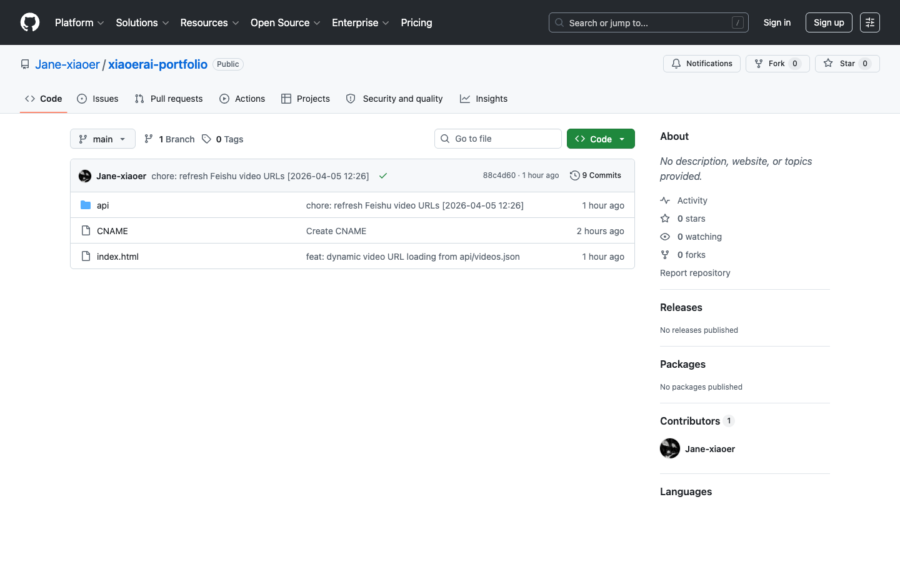

# 用飞书做数据库，零成本上线 AI 作品集

> 适合人群：完全不懂代码的创作者  
> 最终效果：作品放飞书，网站自动展示，链接永不失效  
> 所需费用：域名约 ¥10/年，其余全部免费

---

## 先看最终效果

做完这个教程，你会得到这样一个网站：


---

## 先说清楚我们要做什么

你有一堆视频作品，想在网上展示给客户或者合作方看。

这篇教程要搭的系统是这样的：

```
你 → 把视频传到飞书多维表格
           ↓
   Claude Code 帮你写 HTML 网页
           ↓
   代码上传到 GitHub（免费代码托管）
           ↓
   GitHub Pages 自动变成网站
           ↓
   绑定你自己买的域名
           ↓
   访客打开你的域名，看到你的作品
```

中间有一个小问题需要处理（飞书视频链接24小时过期），我们后面会解决。

---

## 你需要准备什么

开始之前，注册好这几个账号：

- **飞书**（feishu.cn）—— 存你的视频
- **GitHub**（github.com）—— 存你的网页代码
- **NameSilo**（namesilo.com）—— 买域名

工具：
- **Claude Code**（或任意 AI 助手）—— 帮你写 HTML 代码
- **lark-cli**（飞书命令行工具）—— 让脚本能访问飞书

---

## 第一步：把作品整理到飞书多维表格

飞书多维表格就是你的"内容数据库"。你所有的作品信息都存在这里，以后更新也在这里改。

**1.1 创建多维表格**

打开飞书，新建一个"多维表格"。

**1.2 设计字段并整理内容**

建议设置以下字段，把每一个作品填进去：

| 字段名 | 类型 | 说明 |
|---|---|---|
| 序号 | 数字 | 控制展示顺序 |
| 内容 | 文本 | 显示在网站上的标题 |
| 样片 | 附件 | 上传视频本体 |
| 类型 | 单选 | 广告 / 艺术片 / 故事 / 创意动画 等 |
| 时长 | 文本 | 例如：30秒 / 1分51秒 |
| AI工具 | 文本 | 例如：即梦、剪映 |

填好之后大概是这样的：


**1.3 理解 file_token 的概念**

视频上传到飞书的"附件"字段后，每个视频在飞书系统里有一个唯一的永久 ID，叫 **file_token**，类似这样：

```
Al0Xbi5PioKbckxy6NscTgR0n2g
```

> **重要：**  
> file_token 是你视频的"永久身份证"，不会变。  
> 但视频的"播放链接（URL）"是临时的，24小时后失效。  
> 我们后面用脚本自动解决这个问题，你不用担心。

---

## 第二步：安装飞书命令行工具 lark-cli

lark-cli 是飞书提供的命令行工具，装好之后，脚本就能自动去飞书拿数据，不需要你手动操作。

**这一步直接丢给 Claude Code / Cursor / Windsurf 等 AI 编程工具来做。**

把下面这段话发给你的 AI 工具：

> 帮我在这台 Mac 上安装飞书命令行工具 lark-cli，然后帮我登录飞书账号完成授权。需要的话先安装 Node.js。

AI 会自动打开终端、执行安装命令、引导你完成飞书账号授权。你只需要在弹出的浏览器窗口里点"授权"就行。

---

## 第三步：用 AI 写 HTML 网页

这一步你不需要懂代码。把数据交给 Claude Code，让 AI 帮你写。

**3.1 导出你的素材数据**

把下面这段话发给你的 AI 工具，同时把你的飞书多维表格链接或 app_token 告诉它：

> 用 lark-cli 把我飞书多维表格里的所有记录导出成 feishu_data.json 文件。表格地址是：[粘贴你的飞书表格链接]

AI 会帮你执行命令，生成包含所有作品信息和 file_token 的数据文件。

**3.2 告诉 AI 你要什么**

把 feishu_data.json 文件和下面这段需求一起发给 AI：

```
我有一个 AI 视频作品集，数据在附件的 feishu_data.json 里。
帮我写一个单页 HTML 文件，要求：
- Pinterest 瀑布流布局（4列，手机上变2列）
- 每个作品显示：视频封面、标题、分类标签、时长、使用工具
- 点击视频可以播放，同时只播一个
- 顶部有分类筛选按钮
- 视频用 data-token 属性存 file_token，不直接放 src
- 页面加载时 fetch /api/videos.json，把 URL 填入对应视频
- 风格：暖色调，Aesop 品牌感，衬线字体
```

AI 会生成一个完整的 `index.html` 文件。

**3.3 在本地预览，调整到满意**

双击 `index.html` 用浏览器打开，如果不满意，继续告诉 AI 调整：

- "背景色改成更暖的米白"
- "卡片圆角再大一点"
- "分类标签用胶囊形状"

调到满意为止，这一步不着急。

---

## 第四步：把代码上传到 GitHub

GitHub 是免费的代码托管平台。你的网页代码存在这里，GitHub Pages 可以直接把它变成网站。

**4.1 注册并创建仓库**

登录 GitHub，点右上角的 `+`，选 `New repository`。

- Repository name：填任意名称，比如 `my-portfolio`
- 选 `Public`（必须公开，GitHub Pages 才能用）
- 点 `Create repository`

**4.2 上传文件**

这一步也可以直接丢给 AI 工具来做：

> 帮我在 GitHub 上创建一个名为 my-portfolio 的公开仓库，把当前目录下的 index.html 和 CNAME 文件推送上去。

AI 会帮你处理 git 初始化、关联仓库、提交、推送的全部操作。

你也可以在 GitHub 网页上手动拖文件上传：在仓库页面把 `index.html` 拖进去，写提交说明，点 `Commit changes`。



---

## 第五步：开启 GitHub Pages

**5.1 进入 Pages 设置**

在仓库页面，点上方的 `Settings` → 左侧找 `Pages`。

**5.2 选择来源并保存**

- Source 选 `Deploy from a branch`
- Branch 选 `main`，文件夹选 `/ (root)`
- 点 `Save`


等几分钟后，页面会显示：

> **Your site is live at http://你的用户名.github.io/仓库名**

点进去就能看到你的作品集了。

---

## 第六步：绑定自己的域名

现在的地址是 github.io 的，不够专业。我们来绑一个自己的域名。

**6.1 购买域名**

去 NameSilo（namesilo.com）搜索你想要的域名。`.xyz` 后缀大约 ¥10/年，`.com` 大约 ¥60-80/年。

购买后，在域名管理页可以看到域名概览：


**6.2 添加 DNS 记录**

点上方的 `DNS` 标签，进入 DNS 管理页。点右上角 `Add DNS Record`，添加以下记录：

| 类型 | Host | Address/Value |
|---|---|---|
| A | @ | 185.199.108.153 |
| A | @ | 185.199.109.153 |
| A | @ | 185.199.110.153 |
| A | @ | 185.199.111.153 |
| CNAME | www | 你的GitHub用户名.github.io |

添加完大概是这样的效果：


> NameSilo 自带的 DNS 服务叫 dnsowl，不需要修改 Nameserver，直接在这里加记录就好。

**6.3 在 GitHub 填入域名**

回到 GitHub Pages 设置页，在 `Custom domain` 框里填你的域名（比如 `xiaoerai.xyz`），点 Save。

在仓库根目录新建一个叫 `CNAME` 的文件（注意没有后缀名），内容只有一行，就是你的域名：

```
xiaoerai.xyz
```

**6.4 等待生效**

DNS 生效需要 10 分钟到几小时。生效后，打开你的域名就能看到网站了。

> GitHub Pages 会自动申请 HTTPS 证书，申请完成后域名前面会出现锁的图标，表示安全连接生效。

---

## 第七步：解决视频链接过期问题

上线之后你会发现，24小时后视频播不了了。这是飞书的安全机制——视频播放链接24小时过期。

**解决思路**

每20小时，让你的电脑自动去飞书换一批新链接，存成一个文件推到 GitHub。网页每次打开时读这个文件，拿到的永远是新链接。

**7.1 让 AI 帮你搭好整套刷新机制**

这一步把所有技术细节都交给 AI。把下面这段话发给你的 Claude Code（或 Cursor / Codex 等）：

> 我的飞书视频链接24小时过期。帮我搭一套自动刷新机制：
> 1. 写一个 Python 脚本，用 lark-cli 分批（每批5个）获取这些 file_token 的飞书临时下载 URL，把 token→URL 的映射存成 `api/videos.json`，然后自动 git commit 并 push 到 GitHub
> 2. 设置 macOS launchd，让这个脚本每20小时自动运行一次
> 3. 运行一次测试，确认能拿到 URL 并成功推送
>
> 我的 file_token 列表是：[把你的所有 token 粘贴进来]

AI 会完成脚本编写、launchd 配置、测试运行的全部工作。你只需要看着它跑，最后确认推送成功就行。

> **获取你的 file_token 列表的方法：**  
> 告诉 AI："用 lark-cli 帮我列出飞书多维表格里所有视频附件的 file_token"，AI 会帮你提取。

---

## 最终效果

整个系统搭好之后，网站长这样：

**首页：**


**作品网格：**


**联系页：**


---

## 以后怎么更新内容

**加新作品：**

1. 在飞书多维表格新增一行，上传视频
2. 让 lark-cli 或 Claude Code 帮你找到新视频的 file_token
3. 把 token 加到 `scripts/refresh-videos.py` 的列表里
4. 在 `index.html` 里加一个新卡片（告诉 AI，它帮你写）
5. Push 到 GitHub，网站自动更新

**改排版风格：**

直接告诉 Claude Code 想改什么，改完 Push。

---

## 整个系统的角色总结

| 角色 | 由谁扮演 | 费用 |
|---|---|---|
| 视频存储 | 飞书多维表格 | 免费 |
| 代码托管 | GitHub | 免费 |
| 网站服务器 | GitHub Pages | 免费 |
| 域名 | NameSilo | ~¥10/年 |
| 写代码 | Claude Code / AI | 免费或极低 |
| 定时刷新链接 | 你的 Mac + Python 脚本 | 免费（10秒/次，不费电）|

---

## 常见问题

**Q：Mac 关机了怎么办？**  
关机期间不刷新。开机后在下一个20小时周期自动补。如果 Mac 经常关机超过24小时，可以让 AI 帮你把脚本改成"开机时也立刻跑一次"。

**Q：以后换电脑了怎么办？**  
在新电脑上重新安装 lark-cli，登录飞书，把 launchd 配置文件复制过去重新注册。代码存在 GitHub，不会丢。

**Q：能放图片作品吗？**  
可以。飞书图片同样有 file_token，机制完全一样。图片链接有效期更长（通常72小时），可以适当减少刷新频率。

**Q：视频能被别人下载吗？**  
飞书的临时链接有防盗限制，普通访客无法直接下载。

---

## 总结

这套方案的核心思路是：**用现有工具的免费额度，组合出一个自己控制的系统。**

- 飞书的多维表格可以当数据库用
- GitHub 的 Pages 功能可以免费托管网站
- AI 直接帮你写代码，不需要自己学编程

你只需要负责内容本身，其他的交给工具和 AI。

---

*有问题欢迎留言。*
